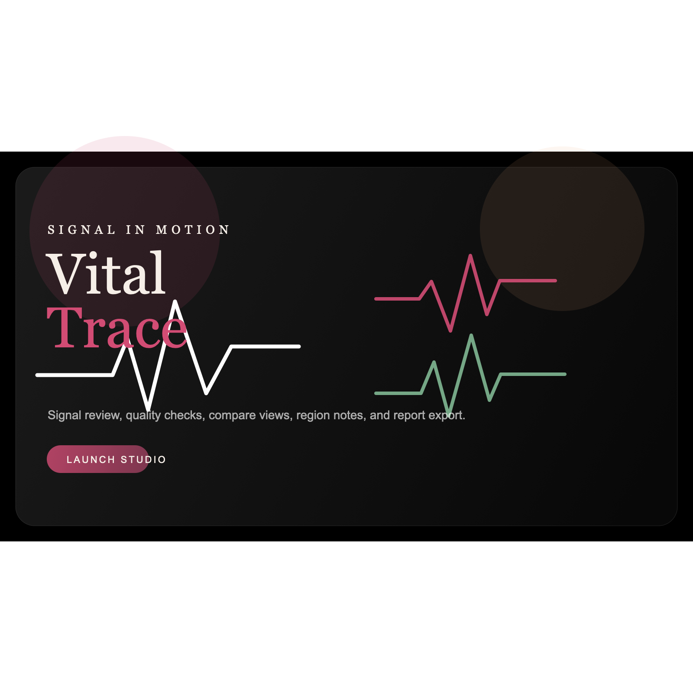

# Vital Trace

Vital Trace is a browser-based physiological signal review environment. It combines a user-friendly front end with a working analysis workspace for ECG, EMG, PPG, respiration, motion-derived traces, and synthetic signals.

It is a prototype review tool for biosignal analysis. It is not a medical device and is not intended for clinical diagnosis. Designed solely by Avi Patel, for internal use only. 

## What it includes

- Scroll-driven landing experience with route-based product story
- Studio workspace with sample datasets, uploads, filters, comparison, annotations, and report export
- Review Center with insight summary, quality review, region notebook, recovery timeline, and report builder
- Compare, batch review, and synthetic signal workflows
- Built-in demos for resting ECG, motion-corrupted ECG, EMG burst activity, PPG pulse review, respiration, and synthetic noise
- Client-side signal processing for smoothing, detrending, baseline correction, band filtering, notch filtering, peak detection, RMS, interval summaries, FFT, and spectrogram views
- PDF report export and plot image export
- Local session restore in the browser

## Stack

- React
- TypeScript
- Vite
- Tailwind CSS
- Framer Motion
- Zustand
- PDF-lib

## Run locally

```bash
npm install
npm run dev
```

Open `http://127.0.0.1:4173`.

The generated sample files are already committed in `public/samples/`. If you want to regenerate them:

```bash
npm run samples:generate
```

## Production build

```bash
npm run build
```

The output lands in `dist/` and can be deployed to a static host such as Vercel.

## Project structure

```text
public/
  samples/        bundled demo recordings
  images/         preview assets
  favicons/       brand icon
src/
  routes/         home, studio, review, batch, synthetic, reports
  components/     layout, charts, controls, report UI
  hooks/          cursor, scroll, session, and processing hooks
  lib/            parsing, filters, detection, FFT, metrics, export
  store/          studio state
  data/           demo datasets and case content
  types/          shared models
docs/
  screenshots/    captured route previews
  design-notes.md
  demo-notes.md
```

## Screenshots
- Need to Update (developer view)

